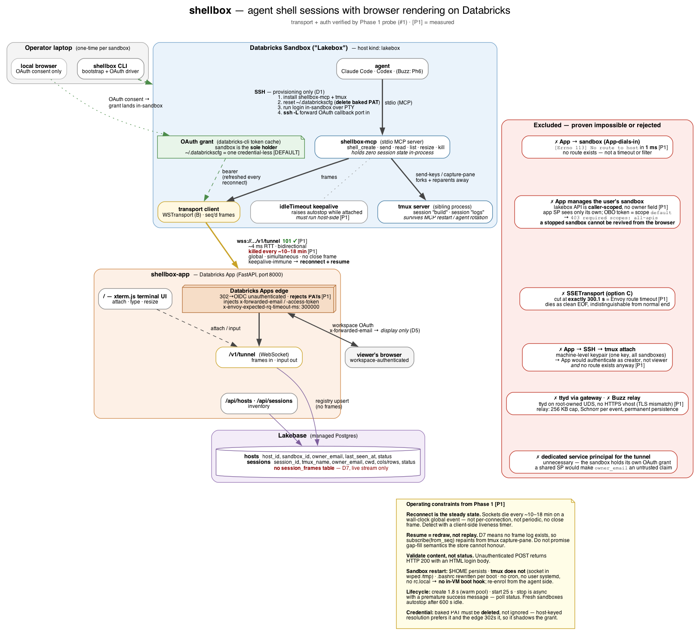

# shellbox — architecture

This doc follows the writing standard in [`docs/writing-style.md`](writing-style.md).



Source: [`architecture.dot`](architecture.dot) · regenerate with:

```sh
dot -Tpng docs/architecture.dot -o docs/architecture.png
dot -Tsvg docs/architecture.dot -o docs/architecture.svg
```

Annotations marked **[P1]** are measured results from the Phase 1 probe
([#1](https://github.com/IceRhymers/shellbox/issues/1)), not assumptions. Full raw
findings live in the probe's comment on that issue.

---

## The three paths

**1. Live data path** (bold + gold). The agent drives `shellbox-mcp` over stdio.
The MCP server controls a tmux server that is its *sibling*, not its child, so
sessions outlive MCP restarts and agent rotation. Frames go out over a single
WebSocket the sandbox dials. The App renders them in xterm.js and sends input back
down the same socket.

**2. Bootstrap path** (green, dashed — once per sandbox), over SSH, which
[D1](https://github.com/IceRhymers/shellbox/issues/9) reserves for provisioning
only:

- Install `shellbox-mcp` and tmux.
- **Delete the image's baked PAT.**
- Run the login *inside* the sandbox, over a PTY.
- `ssh -L` the OAuth callback port in, so the local browser's redirect reaches
  the in-sandbox listener.

The sandbox ends up the sole holder of its own OAuth grant.

**3. Registry path** (purple). Lakebase holds `hosts` and `sessions` only. There is
no frame table — D7 is live-stream-only.

## Why the arrows point the way they do

The direction is forced, not chosen. **App → sandbox is impossible**: outbound TCP
from the App container to the sandbox gateway fails with `[Errno 113] No route to
host` in 1 ms. Every design where the App reaches in is dead, which is why the
sandbox dials out and why `App→SSH→tmux attach` is excluded twice over.

## ADR-39: the registry is the trust boundary, and it cannot be subdivided

**A registry is one trust domain.** Every host, agent, and viewer that shares one can reach
every session in it. So run **one registry per trust domain**, and enable shellbox only where
all of them are mutually trusted.

Nothing here is new behaviour. Three decisions already recorded separately compose into a
consequence none of them states on its own, and this ADR is that consequence.

| Already recorded | What it says |
|---|---|
| `D5` | `X-Forwarded-Email` is identity **display**, never authorization. Both inventory routes return the same rows whatever the header says. |
| `D6` | Access is **default-open**: the App is reachable by every workspace user, and the inventory is the product rather than a per-viewer secret. |
| `R6` | `owner_email` is **forgeable**. It is stamped by the host from a credential that authenticates as the sandbox's *creator* — a confused deputy that, on the measured sandbox, belongs to a workspace admin. |

The consequence: **any workspace user the edge admits can attach to any session by id and type
into it.** `serve_subscriber` in
[`server.py`](../packages/shellbox-app/src/shellbox_app/server.py) relays the subscriber's input
to the publisher, and the only refusals on that path are `publisher_conflict` and
`subscriber_conflict` — concurrency, not authorization. The `owner_email` label that might let a
viewer self-select is itself `R6`-forgeable, so it cannot be hardened into a filter either.

`viewer_owns` in [`inventory.py`](../packages/shellbox-app/src/shellbox_app/inventory.py) exists
for the `mine` label "and nothing else", and the query layer's `list_hosts(owner_email=...)`
filter is deliberately left unused by the App. Both are `D6` working as designed, not gaps.

### Why this is forced rather than deferred out of laziness

`shellbox_app/__init__.py` records the reason: **an authorization rule here needs a credential
from outside the App.** Without an on-behalf-of token, `current_user.me()` returns the App's own
service principal, so the App cannot distinguish one workspace user from another by any means
the Apps runtime provides. The edge-injected header is all there is, and a header the App cannot
verify is not a permission check. That is the same shape as the impossibility above: a platform
constraint, measured, not a design preference.

What *is* enforced today, so this ADR does not overclaim in the other direction: the App's
service principal is **SELECT-only** on the registry (`A15`), asserted by
[`test_grant_scope.py`](../tests/unit/test_grant_scope.py),
[`test_no_app_writes.py`](../tests/unit/test_no_app_writes.py), and
[`test_grant_enforcement.py`](../tests/registry/test_grant_enforcement.py). The gap is
specifically **authorization between hosts**, not authentication in general — the edge still
authenticates every request that reaches the App.

### Consequences

- **shellbox stays optional in every integration.** A tool that needs no infra must not acquire
  a dependency on infra plus a trust precondition. This is what shapes the Buzz work: `ADR-38`
  in [`registration.md`](registration.md) records that buzz-lakebox gains only generic,
  content-blind extension points and never learns what shellbox is.
- **Do not point two trust domains at one registry.** Merging them is structural, and no
  configuration undoes it.
- **Superseded by [#7](https://github.com/IceRhymers/shellbox/issues/7)** (ACL enforcement and
  per-host enrollment tokens). Per `R6` that work must replace the host-side `owner_email` stamp
  with a per-host enrollment token; hardening the read path alone would authorize against a
  value the host can forge.

## What each remaining phase must do differently

### Phase 2 — session plane

The Phase 2 plan is a working document kept outside version control (`.omc/` is
`.gitignore`d), so it is deliberately not linked here. An earlier revision of this file
linked a path no clone contains. §7 of that plan is **transcribed from an executable spike**,
[`spike/tmux_spike.py`](../spike/tmux_spike.py), after three rounds of prose review kept
finding new defects in freshly-rewritten command blocks. (See
[`docs/plan-sections.md`](plan-sections.md) for what plan section numbers like `§7` mean.)
The measured sandbox facts the plan depends on are committed at
[`docs/sandbox-environment.md`](sandbox-environment.md), with the probe and its raw output
alongside them.

- **The PAT is stamped first, then reset — and the reset belongs to the bootstrap path, not
  `serve`.** Enrolment order is fixed:

  1. Resolve identity via `current_user.me()`.
  2. Cache `owner_email`/`host_id` to `$HOME/.shellbox/host.json`.
  3. Write the `hosts` row.
  4. *(Bootstrap only)* reset `~/.databrickscfg`.

  Deleting the PAT inside `serve` would strand the sandbox with no workspace credential before
  Phase 3's OAuth login exists. `~/.databrickscfg` is a **symlink into `/run/lakebox/`**,
  re-pointed by `ln -sfn` on **every** boot by `/etc/lakebox/setup-home-directory.sh`. So the
  reset must remove the *symlink*, write a regular `$HOME` file, and run **per boot** rather than
  once. (An earlier revision justified this with "`/run` is tmpfs". That is unverifiable from
  inside — `/proc/mounts` lists only the overlay root — and unnecessary: `/run` is *measurably
  wiped between boots*, which is what the code needs. See section 3 of
  [`docs/sandbox-environment.md`](sandbox-environment.md).)
- **Two things make the reset harder than it looks**, both measured after the plan was written:
  - PID 1 exports `DATABRICKS_CONFIG_FILE=/run/lakebox/databrickscfg`, which **overrides the `~/`
    path**. Where an agent inherits it, the reset is a silent no-op.
  - `~/.databricks/token-cache.json` is boot-templated too (currently a *dangling* symlink), so the
    CLI's OAuth token cache does **not** survive a boot. A PAT-reset sandbox has no workspace
    credential at all after a restart, until the login is re-run.

  The second is Phase 3's to own.
- Identity stamping (D4) is confirmed viable: the ambient credential authenticates as the sandbox
  creator, and the Lakebox API exposes **no owner field**. So stamping host-side really is the
  only way to answer "whose sandbox is this." The `$HOME` cache is **reconciled** against the
  credential whenever one is available (credential wins, mismatch logs loudly) rather than
  short-circuiting on it.
- **A sandbox cannot learn its own `sandbox_id`** — not from its environment, its disk, its
  hostname, or even PID 1's environment. So `host_id` is a **self-assigned uuid4** persisted to
  `$HOME/.shellbox/host.json` under an exclusive create (1–32 concurrent processes must adopt one
  winner, not mint one identity each). `sandbox_id` is **injected by the bootstrap path**, which
  runs from outside and does know it. `/etc/machine-id` must never be used: it is image-baked, so
  it is identical on every sandbox from that image.
- **tmux 3.4 is already present at `/usr/bin/tmux`, so vendoring a static binary (D10) is optional,
  not required.** shellbox-mcp resolves the binary from `$SHELLBOX_TMUX_BIN` before falling back
  to `PATH`. It records the resolved path and version on the `hosts` row, so an image bump is
  visible in the registry rather than surfacing as a mystery bug.
- **Four tmux behaviours are load-bearing and each is measured in two lanes** (3.6b/macOS and
  3.4/Ubuntu — identical results):
  - `-t <name>` **prefix- and fnmatch-matches**, so `has-session` is *not* an enforcement boundary and
    one agent could address another's session by naming a prefix. Every targeting verb uses the single
    anchored form **`=<name>:`**; `new-session -s` takes a **bare** name.
  - A **global** `window-size manual` **kills the tmux server on the next `new-session`** (15/15), so
    it appears nowhere in the create path. The **per-window** form is safe (0/15) and is how Phase 3/4
    should set it — never `-g`.
  - `history-limit` must be set **before** the first pane spawns (chained with `start-server`), or the
    pane keeps the 2000 default while `show-options` reports the new global.
  - The pty **line discipline** silently corrupts over-long lines — **dropped on macOS, truncated on
    Linux** — so shellbox-mcp enforces a line-length ceiling before invoking tmux.
- Sessions survive an **MCP restart** but not a **sandbox restart**, and there is no in-VM boot hook
  to fix that. See "What survives what" in [`README.md`](../README.md#what-survives-what).

### Phase 3 — transport
- Ships `WSTransport` (B). `SSETransport` (C) is dead: cut at exactly 300.1 s.
- **Reconnect must be designed for**, on a wall-clock global event that kills every
  open socket at once. Not periodic, not per-connection, keepalive-immune, and it
  sends **no close frame** — so detection must be a client-side liveness timer.
  Phase 1 measured that event arriving every 10–18 minutes; **Phase 4 held sockets
  for 44 and 89 minutes without seeing it at all**, so treat the *frequency* as
  unknown and re-measure before sizing anything against it. The design is unchanged
  — a socket still dies, and full jitter with a nonzero floor is still right — but
  "four times an hour" is no longer a number to build on. See
  [`probe/FINDINGS.md`](../probe/FINDINGS.md).
- `subscribe(session_id, from_seq)` **repaints from `capture-pane`**; it cannot
  gap-fill, because D7 means no frame log exists to replay from.
- Validate response *content*, not status codes. An unauthenticated POST returns
  HTTP 200 with an HTML login body — **measured**, see
  [`probe/FINDINGS.md`](../probe/FINDINGS.md).

### Phase 4 — renderer
- Drop the planned "App SP granted Lakebox sandbox visibility" item. It is not a permissions gap
  to be filled. The API is caller-scoped with no grant path, so the App SP sees only sandboxes it
  created. The injected user OBO token carries scope `default` (`403 required scopes: all-apis`).
- Consequence to design around: **the browser cannot revive a stopped sandbox.** With a 600 s
  default autostop this will be common. Either accept "attach only works if the sandbox is already
  up" or drive revival from outside the App.

### Phase 5 — lifecycle
- The `idleTimeout` keepalive must run **host-side** (as specified) — the sandbox
  can manage its own autostop; the App cannot.
- Host staleness via `last_seen_at` is unaffected, since it reads Lakebase rather
  than the Lakebox API.
- **There is no in-VM boot hook.** `$HOME` survives a restart, but the tmux server does not —
  it is a process, and the VM stops. The boot script rewrites `.bashrc` from a template every
  boot, and there is no cron, no user systemd, and no `rc.local`. The agent side has to drive
  re-enrolment on next start, not anything in the VM.
- Lifecycle timings, **measured** by the Phase 1 probe
  ([`probe/FINDINGS.md`](../probe/FINDINGS.md)):
  - `create`: 1.8 s — from a warm pool, not a cold boot.
  - `start`: 25 s.
  - `stop` is **async with a premature success message** — poll `status` rather than trusting the
    CLI's exit.

---

## Scoping question — RESOLVED (2026-07-31): build

The [premise correction on
#9](https://github.com/IceRhymers/shellbox/issues/9#issuecomment-5137298161) established that
omnigent already implements this architecture on Databricks Apps:

- tmux PTY↔WS bridge
- xterm.js renderer
- terminal CRUD
- host tunnel
- Lakebox launcher
- the in-sandbox OAuth bootstrap drawn above

Three options were scored: **G1** build shellbox as specified, **G2** extend omnigent, **G3**
build the session plane and borrow omnigent's transport and renderer.

**Decision: G1 — build.** The deciding argument is structural rather than about code quality:
omnigent enforces launch-before-use through a **per-process in-memory registry**
(`omnigent/terminals/registry.py:104`). That registry is correct for omnigent, where one process
owns the terminals. shellbox runs **1–32 concurrent MCP processes** with session rotation, under
which in-process session state is wrong within a single turn. [Issue
#2](https://github.com/IceRhymers/shellbox/issues/2) declares that invariant mandatory. "Extend
omnigent" therefore means rewriting the layer that made omnigent attractive, inside a codebase
whose remainder assumes that layer's semantics.

G3 remains the right answer for **Phases 3 and 4**, and is not foreclosed. omnigent's
`ws_bridge.py:447` and `terminal_attach.py:130` already solve the transport and renderer problems
under this exact edge. That includes the ~10–18 minute ingress socket recycle the probe measured
(`omnigent/host/connect.py:1266`). Borrowing there is additive to a shellbox session plane.
